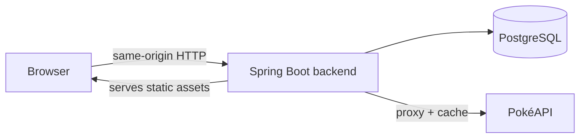
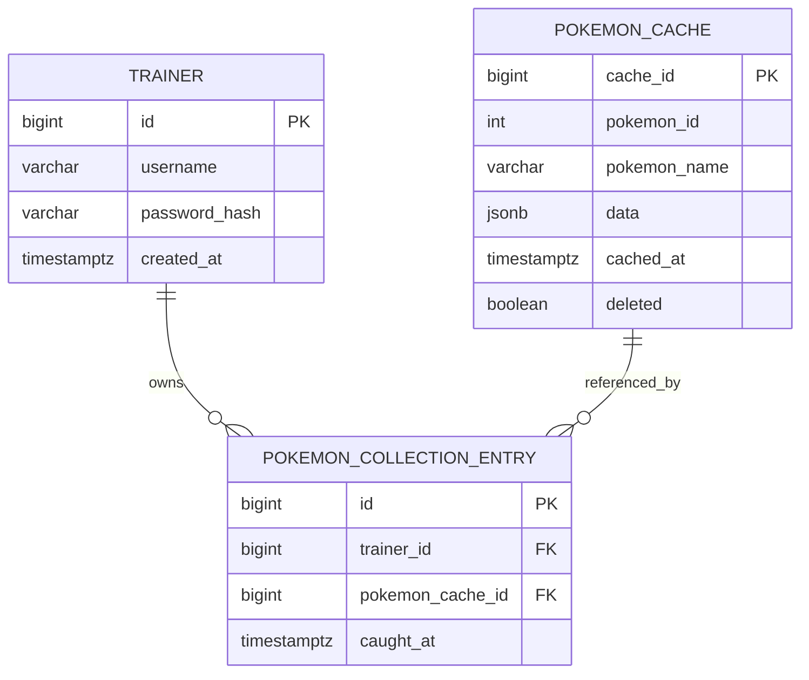
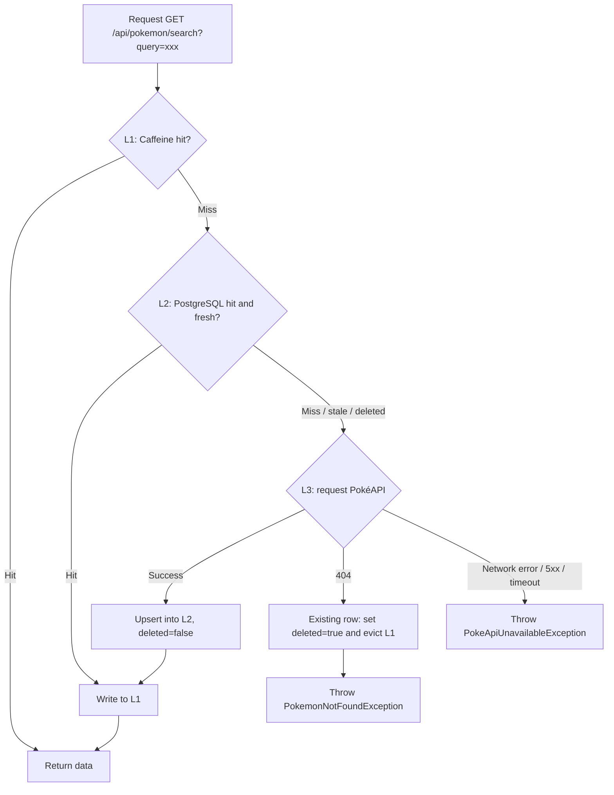

# Pokémon Collection - Architecture & Development Guidelines

## 1. Project Overview and Scope

**Challenge requirements**: a fullstack application in which trainers manage their personal Pokémon collection; frontend + backend + database; trainers can log in and log out; Pokémon data comes from PokéAPI; trainers can add Pokémon to their personal collection and see only their own collection. This project uses Java/Spring Boot + TypeScript/React. The application must be startable reproducibly from the README, and automated tests are required.

**Final feature scope**

- Login / logout (session-based, no self-registration; accounts are seeded through a database migration)
- Exact search for a Pokémon by name or id (data from PokéAPI, proxied by the backend with a three-level cache)
- Add a searched Pokémon to the personal collection; search results carry an `inCollection` flag, so a Pokémon already collected is shown as "Already added" with the add button disabled (see 8.1)
- View only the logged-in trainer's own collection — **server-side paginated**, with a name filter and sorting (see 8.2)
- Remove a Pokémon from the collection

**Explicitly out of scope (non-goals)**

- Self-service registration / password reset
- Fuzzy matching / autocomplete for the PokéAPI search (PokéAPI itself does not support it; this project implements exact search)
- Translating the UI copy into other languages

## 2. Overall Architecture

A three-tier monolith, not split into microservices — at this scale a split would only add complexity, and there is no need for independent scaling or team boundaries.



**Deployment shape**

- Production / delivery shape: a **single Spring Boot process** with embedded Tomcat that serves both the REST API (`/api/**`) and the built React bundles (static assets). Frontend and backend are naturally same-origin; no CORS configuration is needed.
- **The only entry point is `http://localhost:8080`**, in every mode:
  - **Production-like mode** (`docker-compose.yml`): only two services, postgres and backend. The backend image already contains the built frontend; there is no frontend service.
  - **Development mode** (`docker-compose.dev.yml` added on top, `dev` profile): Spring Boot still renders the `/` and `/login` page shells, but the scripts in the page point at the Vite dev server (`app.frontend.vite-dev-server-url`, `http://localhost:5173`). **Port 5173 only serves frontend modules and the hot-reload WebSocket; it is not an entry point**: there are no HTML pages in `frontend/`, Vite has no proxy configured, and opening 5173 directly returns 404. Vite's `server.cors` only allows `http://localhost:8080`, `server.origin` is set to `http://localhost:5173` (so assets imported by modules resolve to 5173), and `strictPort` keeps the port from drifting. The backend source is mounted into the container; changes are compiled automatically and `spring-boot-devtools` restarts the application.
  - Because pages are always rendered by the backend, the CSRF token has exactly one source: the meta tag in the page shell (section 6). No extra handling is needed.
- Database: PostgreSQL in its own container, orchestrated with Docker Compose.
- Cache: in-process application cache (Caffeine); no separate cache service (such as Redis), which fits a small single-instance application.
- Logging: code uses SLF4J throughout; the backend is Spring Boot's default Logback, writing to the console and to a rolling `.log` file (see section 14).

## 3. Technology Stack

| Layer | Technology | Notes |
| --- | --- | --- |
| Backend language / framework | Java 21 + Spring Boot 3.x |  |
| Data access | Spring Data JPA + Hibernate | The only data access method; no hand-written JDBC/DAO |
| Database | PostgreSQL | Native JSONB support |
| Schema management | Flyway | Migration scripts are the single authoritative schema source; `ddl-auto=validate` |
| Cache | Spring Cache abstraction + Caffeine | In-process cache, L1 |
| HTTP client | Spring WebClient | Calls PokéAPI |
| Authentication | Custom `AuthSessionService` + Servlet `HttpSession` (in memory) | Not JWT |
| Security tooling | spring-boot-starter-security (only `PasswordEncoder` + CSRF) | A single `permitAll` `SecurityFilterChain` is configured for CSRF only; no authentication mechanism is enabled (no `formLogin`/`httpBasic`/`AuthenticationManager`); authentication is handled by the custom session logic |
| Page shell rendering | Thymeleaf (`spring-boot-starter-thymeleaf`) | Renders only the HTML shell (CSRF meta, `lang` attribute, hashed asset paths resolved from the Vite manifest); never renders business content or data |
| Build tool | Maven |  |
| Logging | SLF4J (Spring Boot's standard logging facade) + Logback (Spring Boot's default implementation, configured through `logging.*` in `application.yml`) | Console + rolling file `${LOG_PATH}/pokemon-collection.log` (`LOG_PATH` defaults to `logs`); event format and levels in section 14 |
| Configuration | Root `.env` + environment-variable placeholders in `application.yml` | Docker Compose / deployment environments inject values from `.env`; `.env` is not committed, `.env.example` is (see section 12) |
| Frontend framework | React 18 + TypeScript |  |
| Build tool | Vite (multi-entry MPA mode, `build.manifest: true`) | Two independent SPAs: login / app; output file names contain hashes |
| Page state | React component state | The app currently has no client-side routes; search, filter, sort and pagination are not written into the URL |
| Server state | React Query (TanStack Query) | Collection list, Pokémon search |
| HTTP client | Axios (`withCredentials: true`; write requests carry the `X-CSRF-TOKEN` header) |  |
| Styling / icons | Tailwind CSS + local Shadcn-style UI components (`src/components/ui/`) + lucide-react |  |
| Backend tests | JUnit 5 + Mockito, `@WebMvcTest`, `@DataJpaTest` + Testcontainers-Postgres, `@SpringBootTest` integration tests, MockWebServer, `OutputCaptureExtension` |  |
| Frontend tests | Vitest + React Testing Library + MSW |  |
| Infrastructure | Docker + Docker Compose | `docker-compose.yml`: postgres + backend (multi-stage Dockerfile bundles the frontend), the only published port is 8080; `docker-compose.dev.yml`: development override (source mounts, `dev` profile, hot reload, adds the frontend service — the Vite dev server — and the development-only ports) |

## 4. Data Model



**`trainer`** — account data. Passwords are stored as BCrypt hashes; there is no self-registration; accounts are imported through Flyway seed data (see sections 6 and 12).

**`pokemon_cache`** — the persistent L2 cache for PokéAPI data (details in section 5):

- `cache_id`: auto-increment surrogate primary key, used only for internal FK references
- `pokemon_id`: PokéAPI's business id, `UNIQUE`
- `pokemon_name`: the name returned by PokéAPI (always stored lowercase), `UNIQUE`, used for exact search so queries never reach into the JSONB fields; name lookups are always **equality matches** (`pokemon_name = ?`), never `LIKE`/`ILIKE`/`IgnoreCase` — those would bypass the index and would let `pika` match `pikachu`
- **`jsonb` access rule**: `jsonb` operators are only allowed in a `SELECT` list and are **never** used to find or order rows — `WHERE`, `JOIN` and `ORDER BY` always use plain columns (`pokemon_id`, `pokemon_name`, `deleted`, `caught_at`, …). The only place that reads fields inside `data` is the collection read model's projection (8.4), which extracts just the displayed fields
- `data`: the complete raw JSON of the PokéAPI response (`jsonb` column)
- `cached_at`: write/refresh timestamp, used for the freshness check in Java (the TTL is configured by the application, default 7 days, overridable through `APP_POKEMON_CACHE_TTL_DAYS` in `.env`); it is not part of the SQL `WHERE` clause
- `deleted`: `BOOLEAN NOT NULL DEFAULT FALSE` (added in V3). Set to `true` when PokéAPI returns 404 while refreshing a stale row; any later successful refresh resets it to `false` (lifecycle in section 5). L2 lookups only consider rows with `deleted = FALSE`

**`pokemon_collection_entry`** — the trainer's collection relation. The foreign key points at `pokemon_cache.cache_id` (the surrogate key); no data snapshot is duplicated; the `(trainer_id, pokemon_cache_id)` unique constraint prevents duplicate entries; the composite B-tree index `(trainer_id, caught_at DESC)` backs the personal collection list sorted by the time added (the default sort, see 8.2).

```sql
CREATE TABLE trainer (
    id             BIGSERIAL PRIMARY KEY,
    username       VARCHAR(50) NOT NULL UNIQUE,
    password_hash  VARCHAR(100) NOT NULL,
    created_at     TIMESTAMPTZ NOT NULL DEFAULT now()
);

CREATE TABLE pokemon_cache (
    cache_id      BIGSERIAL PRIMARY KEY,
    pokemon_id    INTEGER NOT NULL,
    pokemon_name  VARCHAR(100) NOT NULL,
    data          JSONB NOT NULL,
    cached_at     TIMESTAMPTZ NOT NULL,
    deleted       BOOLEAN NOT NULL DEFAULT FALSE,   -- added in V3
    CONSTRAINT uq_pokemon_cache_pokemon_id UNIQUE (pokemon_id),
    CONSTRAINT uq_pokemon_cache_pokemon_name UNIQUE (pokemon_name)
);

CREATE TABLE pokemon_collection_entry (
    id                BIGSERIAL PRIMARY KEY,
    trainer_id        BIGINT NOT NULL REFERENCES trainer(id),
    pokemon_cache_id  BIGINT NOT NULL REFERENCES pokemon_cache(cache_id),
    caught_at         TIMESTAMPTZ NOT NULL DEFAULT now(),
    UNIQUE (trainer_id, pokemon_cache_id)
);

-- V3: partial indexes over non-deleted rows + collection sort index
CREATE INDEX idx_pokemon_cache_active_pokemon_id   ON pokemon_cache (pokemon_id)   WHERE deleted = FALSE;
CREATE INDEX idx_pokemon_cache_active_pokemon_name ON pokemon_cache (pokemon_name) WHERE deleted = FALSE;
CREATE INDEX idx_pokemon_collection_entry_trainer_caught_at
    ON pokemon_collection_entry (trainer_id, caught_at DESC);
```

**Index design notes**

- Both `pokemon_cache` lookup indexes carry `WHERE deleted = FALSE` (partial indexes): their predicate matches the L2 queries (`...AndDeletedFalse`) exactly, so the query planner picks them directly and needs no extra `deleted` filter step. Measured with `EXPLAIN`: without the partial index, the query uses the unique index plus a filter step and takes about 0.05 ms. At this scale (at most about 1025 rows, rare writes) the difference is below a millisecond, and the write cost of maintaining two extra indexes is negligible as well. They are kept mainly so that the indexes mirror the query pattern; a partial index only pays off noticeably when there are many soft-deleted rows.
- The unique constraints (`uq_pokemon_cache_pokemon_id` / `uq_pokemon_cache_pokemon_name`) must keep covering all rows (including deleted ones) and must not become partial unique indexes: a refresh updates the same row in place, so uniqueness has to apply to every row.
- No listing index on `cached_at`: search fetches a single row by the unique `pokemon_id` or `pokemon_name` and then compares `cached_at` in Java for the TTL; there is no query that pages by cache time.
- `idx_pokemon_collection_entry_trainer_caught_at` matches the shape of the collection list query: filter by `trainer_id`, then order by `caught_at DESC`, so the default sort can be paginated without an extra sort step.

**Indexes PostgreSQL creates automatically**: only `PRIMARY KEY` and `UNIQUE` constraints automatically get a unique index (named like the constraint, e.g. `trainer_pkey`, `trainer_username_key`); **foreign keys do not get an index automatically** (unlike MySQL/InnoDB). `trainer_id` is the leading column of two composite indexes and can use them directly; `pokemon_cache_id` leads no index — there is currently no query that filters the collection table by it alone, and cache rows are only soft-deleted, never physically deleted (so no foreign-key check triggers a full scan). It therefore has no index for now; if statistics such as "how many trainers collected a given Pokémon" or physical deletion of cache rows are ever needed, add a `(pokemon_cache_id)` index.

The unique constraint of `pokemon_collection_entry` is not named explicitly; PostgreSQL names it `pokemon_collection_entry_trainer_id_pokemon_cache_id_key`. `CollectionEntryWriteService` relies on that name to recognise a "concurrent duplicate add" and return `409`; if the constraint is ever renamed, the code must be changed too.

**Current migration files** (applied files must not be edited; the next change starts at `V4__...`): `V1__create_trainer_table.sql` (creates all three core tables at once), `V2__seed_trainers.sql` (seed accounts), `V3__add_deleted_to_pokemon_cache.sql` (the `deleted` column + the indexes above).

**Entity mapping essentials** (key annotations only):

```java
@Entity
@Table(name = "pokemon_cache")
public class PokemonCache {
    @Id
    @GeneratedValue(strategy = GenerationType.IDENTITY)
    @Column(name = "cache_id")
    private Long cacheId;

    @Column(name = "pokemon_id", nullable = false, unique = true)
    private Integer pokemonId;

    @Column(name = "pokemon_name", nullable = false, unique = true, length = 100)
    private String pokemonName;

    @JdbcTypeCode(SqlTypes.JSON)
    @Column(name = "data", nullable = false, columnDefinition = "jsonb")
    private JsonNode data;

    @Column(name = "cached_at", nullable = false)
    private Instant cachedAt;

    @Column(name = "deleted", nullable = false)
    private boolean deleted;
}
```

**Schema authority**: `spring.jpa.hibernate.ddl-auto=validate` — Hibernate only verifies that the entities match the actual tables and never creates or alters tables. Every schema change is a new Flyway migration file, which keeps changes traceable and repeatable (Flyway Community has no automatic rollback; corrections are made with a new forward migration).

## 5. PokéAPI Integration and Three-Level Cache

Search mode: **exact search** (by id or name, matching what PokéAPI itself supports); no fuzzy matching or autocomplete. The lookup chain follows **cache-on-search**: only Pokémon that have been searched are cached; there is no full preload.

**id / name dispatch**: `PokemonController` trims `query` and checks it — a value matching `\d+` goes to `getById`, anything else to `getByName`; an empty string returns `400 BAD_REQUEST`. `getByName` first normalises the name in Java with `trim().toLowerCase(Locale.ROOT)`, and then all three levels match by **equality**: L1 by key equality, L2 with `findByPokemonNameAndDeletedFalse` (`pokemon_name = ?`), L3 by requesting `/pokemon/{name}`. Input `PIKACHU` finds `pikachu`; input `pika` returns `404`.



**L1 — Caffeine (in memory, short TTL)**

- Two separate caches: `pokemonById` (key = pokemonId) and `pokemonByName` (key = lowercase name), `maximumSize=1000`, `expireAfterWrite=1h`
- No declarative `@Cacheable`; the `CacheManager` is used manually instead, because one lookup has to read and write **both** keys (a lookup by id also writes the name key, and vice versa), and the declarative annotation cannot express this "dual write"

**L2 — PostgreSQL table `pokemon_cache` (persistent, long TTL)**

- Queried by `pokemon_id` or `pokemon_name`, **active rows only** (`findByPokemonIdAndDeletedFalse` / `findByPokemonNameAndDeletedFalse`, using the `WHERE deleted = FALSE` partial indexes, never touching JSONB fields); a row with `deleted = true` counts as a miss
- Freshness check (TTL, default 7 days, injected through the `app.pokemon-cache.ttl-days` property, which `application.yml` binds to the environment variable `APP_POKEMON_CACHE_TTL_DAYS`, so operators only change `.env` — no code change or rebuild, see section 12) is **not** part of the SQL `WHERE` clause: the row is fetched and `cached_at` is compared in Java. Benefit: the TTL boundary logic can be unit-tested with a mocked clock, independent of database time functions
- A stale row counts as a miss and the lookup continues with L3

**L3 — external PokéAPI**

- Called through `WebClient` with an overall timeout via `block(timeout)` (`app.pokeapi.timeout-seconds`, default 5 seconds) so requests never hang; a timeout is logged as `TIMEOUT`, a connection failure as `CONNECTION_ERROR`, and an empty response body is also treated as upstream unavailable (`502`)
- The response buffer limit is raised to 2 MB (`maxInMemorySize`): a single Pokémon's full JSON is about 190–320 kB, above WebClient's default of 256 kB
- On success: the full JSON is upserted into `pokemon_cache` as-is (also writing the indexed `pokemon_id` and `pokemon_name` columns), `cached_at` is updated, **`deleted` is set to `false`**, and then both L1 keys are written

**`deleted` lifecycle** (the refresh loads the existing row with the unfiltered `findByPokemonId` / `findByPokemonName` and updates it in place instead of inserting a new row):

| L3 result | `pokemon_cache` | L1 | Response |
| --- | --- | --- | --- |
| Success | upsert, update `cached_at`, `deleted = false` | write id/name keys | `200` |
| PokéAPI `404` | existing row: set `deleted = true` and save; no row: nothing is written | evict the row's id/name keys | `404` |
| Timeout / connection failure / `5xx` | no change at all (the stale row is **not** returned as a fallback, see 5.2) | no change | `502` |

A success **must** reset `deleted = false`: if PokéAPI wrongly returned 404 during an outage and the row was marked deleted, the next successful refresh restores it automatically instead of leaving it unavailable forever.

**Concurrent writes**: when two requests look up the same Pokémon for the first time at the same moment, both request PokéAPI and try to insert; the later insert hits the `pokemon_id`/`pokemon_name` unique constraint, and the service then reads the row written by the other request and logs `POKEMON_CACHE_CONCURRENT_WRITE` instead of failing the user's request. (Concurrent requests for the same key still call PokéAPI once each; to coalesce them, Caffeine's `get(key, loader)` could be used.)

**Error handling — two failure semantics, strictly separated**

| Situation | PokéAPI behaviour | Backend exception | HTTP status | Frontend message |
| --- | --- | --- | --- | --- |
| The requested Pokémon really does not exist | returns `404` | `PokemonNotFoundException` | `404 Not Found` | "No matching Pokémon found. Check the spelling or number." |
| PokéAPI unreachable | timeout / connection failure / `5xx` | `PokeApiUnavailableException` | `502 Bad Gateway` | "The Pokémon data service is temporarily unavailable. Please try again later." + Retry button |

"Upstream unavailable" must **never** be shown as "not found" — the two tell the user to do completely different things (change the input vs. try again later). `502 Bad Gateway` states precisely that "this service is fine, but the upstream it depends on failed".

**Core service logic (pseudocode)**:

```java
@Service
public class PokemonLookupService {

    public PokemonDetailDto getById(Integer pokemonId) {
        return lookup(cacheManager.getCache("pokemonById"), pokemonId,
            () -> repository.findByPokemonIdAndDeletedFalse(pokemonId),
            () -> pokeApiClient.fetchByIdentifier(String.valueOf(pokemonId)));
    }

    public PokemonDetailDto getByName(String rawName) {
        String name = rawName.trim().toLowerCase(Locale.ROOT); // normalise, then match by equality
        return lookup(cacheManager.getCache("pokemonByName"), name,
            () -> repository.findByPokemonNameAndDeletedFalse(name),
            () -> pokeApiClient.fetchByIdentifier(name));
    }

    private PokemonDetailDto lookup(Cache l1, Object l1Key,
            Supplier<Optional<PokemonCache>> l2Lookup, Supplier<JsonNode> apiFetch) {
        Cache.ValueWrapper hit = l1.get(l1Key);
        if (hit != null) return (PokemonDetailDto) hit.get();

        Optional<PokemonCache> entity = l2Lookup.get();
        if (entity.isPresent() && isFresh(entity.get().getCachedAt())) {
            return writeThrough(toDto(entity.get()));
        }

        // load the existing row without the deleted filter (including deleted rows) and update it in place
        PokemonCache existing = findExistingIncludingDeleted().orElseGet(PokemonCache::new);
        JsonNode fresh;
        try {
            fresh = apiFetch.get(); // throws NotFound / Unavailable
        } catch (PokemonNotFoundException e) {
            markDeletedAndEvictL1(existing); // only an existing row is marked
            throw e;
        }
        PokemonCache saved = upsert(existing, fresh); // also setDeleted(false)
        return writeThrough(toDto(saved));
    }

    private PokemonDetailDto writeThrough(PokemonDetailDto dto) {
        cacheManager.getCache("pokemonById").put(dto.pokemonId(), dto);
        cacheManager.getCache("pokemonByName").put(dto.name(), dto);
        return dto;
    }
}
```

### 5.1 Where Each Cache Level Is Used

L1 (Caffeine) **only serves search / lookup by id** (`getById` / `getByName`) — these keys are deterministic and accessed repeatedly, which makes them a good fit for memory with a high hit rate.

**The collection list** (all pagination, sorting and name filtering):

- Reads PostgreSQL directly through the join between the collection table and `pokemon_cache`, and **neither reads nor writes L1**. A trainer's paginated collection is mostly long-tail data that is rarely accessed; putting it into L1 would evict the frequently used search keys and collapse the hit rate.
- **Does not check the TTL and never calls PokéAPI**: rows are shown as stored, even if `cached_at` is past the TTL. A Pokémon is only refreshed when it is searched again.

### 5.2 Staleness Principle: Lenient Reads, Strict Writes

Pokémon data is reference data and effectively static (when it does change, it is mostly presentation such as sprites). That leads to one principle with two sides:

- **Reading existing collection entries tolerates stale data**: the collection list shows the data as stored in the database, ignores the TTL, and never calls PokéAPI (5.1). Showing stale data there carries no risk, and it keeps the collection list completely independent of PokéAPI — the list works during a PokéAPI outage.
- **Creating a new collection entry requires valid data**: a new collection relation is only created on a cache row that is within the TTL or has just been confirmed by PokéAPI. If the row is stale and PokéAPI is unavailable, the system cannot confirm that the Pokémon still exists upstream (it may have been removed — exactly the case the `deleted` flag handles), so search and add explicitly return `502` with "try again later" instead of creating a new collection relation on unverified data.

**Resulting decisions**

- **No "return stale data when upstream fails" (stale-if-error) on the lookup path**: returning the stale row when PokéAPI times out or returns 5xx was considered and deliberately rejected — it would let a trainer add a Pokémon that may no longer exist. Do not "improve" `PokemonLookupService` into returning stale data without confirmation.
- **"Show the stale search result but disable the add button" was also considered and not adopted for now**: it adds a frontend state and its copy for little benefit within the current scope.
- **Refresh is demand-driven**: a stale cache row is refreshed the next time someone searches that Pokémon (if the refresh fails, the row stays stale and the next search tries again). Rarely used Pokémon are therefore refreshed exactly when a user needs them; no scheduled refresh job is needed.
- **Retries are only user-initiated** (frontend queries set `retry: false`), so a PokéAPI outage does not turn into an automatic retry storm against the recovering service.

## 6. Authentication and Sessions

**Decision: session-based auth, not JWT.** Reason: a single-instance deployment with no horizontal-scaling need gets nothing from JWT's statelessness, while JWT would add signing, expiry and blacklist complexity; sessions support `invalidate()` natively, so logout has clear, real effect.

**Storage**: Spring Boot's default in-memory session (provided by Tomcat); no external store such as Redis, which fits a small single-instance application.

**Business abstraction**: controllers and services never touch `HttpServletRequest`/`HttpSession` directly; they go through the domain-level `AuthSessionService` interface, which is easy to mock in unit tests and leaves room for another implementation (e.g. distributed sessions) later. (Note: swapping the storage itself is already supported by Spring Session; the value of this interface is decoupling business code from the Servlet API.)

```java
public interface AuthSessionService {
    void login(HttpServletRequest request, Long trainerId);
    Optional<Long> getCurrentTrainerId(HttpServletRequest request);
    void logout(HttpServletRequest request);
}

@Service
public class HttpSessionAuthService implements AuthSessionService {
    private static final String ATTR_TRAINER_ID = "TRAINER_ID";

    public void login(HttpServletRequest request, Long trainerId) {
        HttpSession old = request.getSession(false);
        if (old != null) old.invalidate(); // session fixation protection
        request.getSession(true).setAttribute(ATTR_TRAINER_ID, trainerId);
    }

    public Optional<Long> getCurrentTrainerId(HttpServletRequest request) {
        HttpSession session = request.getSession(false);
        return session == null ? Optional.empty()
            : Optional.ofNullable((Long) session.getAttribute(ATTR_TRAINER_ID));
    }

    public void logout(HttpServletRequest request) {
        HttpSession session = request.getSession(false);
        if (session != null) session.invalidate();
    }
}
```

**Authentication interceptor** (takes the role a JWT filter would have, and only intercepts paths that require login):

```java
@Component
public class AuthInterceptor implements HandlerInterceptor {
    private final AuthSessionService authSessionService;

    public boolean preHandle(HttpServletRequest req, HttpServletResponse resp, Object handler) throws IOException {
        if (authSessionService.getCurrentTrainerId(req).isPresent()) return true;
        resp.setStatus(HttpServletResponse.SC_UNAUTHORIZED);
        resp.setContentType("application/json");
        resp.setCharacterEncoding("UTF-8");
        resp.getWriter().write("{\"error\":\"UNAUTHORIZED\",\"message\":\"Authentication is required.\"}");
        return false;   // same unified JSON error body as every other error
    }
}

@Configuration
public class WebConfig implements WebMvcConfigurer {
    public void addInterceptors(InterceptorRegistry registry) {
        registry.addInterceptor(authInterceptor)
                .addPathPatterns("/api/collection/**", "/api/auth/me", "/api/auth/logout");
    }
}
```

**Scope of Spring Security (deliberately narrow)**: `spring-boot-starter-security` is included for exactly two capabilities — `PasswordEncoder` (BCrypt password hashing) and CSRF protection (`HttpSessionCsrfTokenRepository`). `SecurityConfig` configures a single `SecurityFilterChain` that permits all requests (`permitAll`) in order to enable CSRF, and a custom `AccessDeniedHandler` returns every CSRF failure as `403 {"error":"CSRF_FORBIDDEN",...}`. **No** authentication mechanism is enabled (`formLogin`, `httpBasic`, `AuthenticationManager`), and `UserDetailsServiceAutoConfiguration` is excluded, so nothing conflicts with or duplicates the custom session logic.

**Login response format**: **JSON**, never a real HTTP 3xx redirect — `200` with the trainer data on success, `401` with an error body on failure. Reason: with `axios`/`fetch`, the browser follows a 3xx automatically and downgrades the method to GET, so the JS code never gets a clean "login succeeded" signal — `.then()` receives the body of the page it was redirected to, which muddles semantics and error handling. After a `200`, the frontend itself performs an **explicit hard navigation** with `window.location.href = '/'` (the effect is the same full page load that loads the app's separate bundle, but the flow stays fully controllable and testable).

**Same origin and cookies**: frontend and backend run in the same process on the same port, so they are naturally same-origin; development mode is also accessed only through 8080 (section 2), so API requests are always same-origin. The `JSESSIONID` attributes are configured in `application.yml`: `HttpOnly` (protects against theft via XSS), `SameSite=Lax`, and `Secure` controlled by `SESSION_COOKIE_SECURE` in `.env` (set to `true` for production over HTTPS). All frontend requests use `withCredentials: true`.

**How the CSRF token works**: `HttpSessionCsrfTokenRepository` + Thymeleaf writes the token into `<meta name="_csrf">` when rendering the page shell (see section 7). At startup the frontend reads the meta tags (`_csrf` and `_csrf_header`; the header name is `X-CSRF-TOKEN`), and an axios request interceptor sends it on every `POST`/`PUT`/`PATCH`/`DELETE`; the token is never read from a cookie and the header name is never hard-coded. The token lives in the `HttpSession` and is bound to it — there is no JS-readable CSRF cookie. Only requests that actually render a page shell and read the meta token create an anonymous `HttpSession`; API calls, static assets and any other cookieless requests do not create a session just to prepare CSRF. Login and logout invalidate the old session, and the old token dies with it.

**Important distinction: CSRF is not brute-force protection.** CSRF defends against "a logged-in user being tricked by a malicious third-party page into sending a request without knowing it" — a cross-site attack. "Preventing mass password guessing against the login endpoint" is **rate limiting / brute-force protection**, a completely separate mechanism (e.g. counting failed logins with lockout, IP rate limiting), which a CSRF token cannot replace. CSRF is part of this design; rate limiting is listed as a separate hardening item in the section 13 backlog and is not required for the first version.

**Username enumeration protection**: when the username does not exist, the login endpoint still performs one BCrypt comparison against a fixed hash, so "unknown username" and "wrong password" take the same time; both cases return the same `401` and the same message.

**User accounts**: there is no self-registration endpoint or page. Seed trainer accounts are inserted directly by a **Flyway migration SQL** (passwords hashed with BCrypt in advance and written into the SQL), the same idea as Laravel's `artisan migrate --seed`. The README must list the test accounts' plaintext usernames/passwords so reviewers can log in directly.

## 7. Frontend Architecture

**Two-SPA structure**: login and the application are physically split into two independent entry points, each built into its own JS bundle:

- `/login`: a minimal login page, no router or complex state management; it only submits username/password and shows errors
- `/`: the main application SPA — collection management and Pokémon search; there are no client-side routes, and list search, filtering, sorting and pagination use component state

Motivation: separation of concerns and a faster login page; also a layer of **defense in depth** — a browser that is not logged in never loads the full application JS, which reduces cheap information probing. (**Note**: this does not replace the backend session check; it is only a bonus. The real access-control boundary is always the backend `AuthInterceptor`.)

**Boundary between Thymeleaf and React: there are exactly two kinds of template.**

| Kind | Templates | May contain | Must not contain |
| --- | --- | --- | --- |
| **Page shell** | `templates/login.html`, `templates/index.html` (sharing `layout/base.html`) | meta tags (CSRF, `lang`, language), favicon link, hashed script/link tags, the empty `#root` mount point | any visible content, business data, conditionals on business state |
| **Static error page** | `error/404.html` only | fixed, hard-coded copy (heading, message, link to `/`), favicon link, `lang`/language meta, static CSS from `/assets/` or inline styles | business data, React bundles, CSRF token, login-state checks, any `th:if` other than locale |

In both kinds, `th:*` expressions may only read the locale, the CSRF token (page shells only) and asset paths. Everything the user interacts with — login-state decisions, what to show, rendering actual content — happens in React. Server-side routing decisions are limited to two things in `PageController`: the page-route whitelist (7.1) and one entry guard (a logged-in user requesting `/login` is redirected to `/`). A new template that fits neither kind needs approval first.

There are only two server-side page routes, `/` and `/login`, and **no SPA catch-all route**; all static assets live under `/assets/`, the favicon is declared explicitly in the HTML, and unknown URLs get a 404 page rendered by Thymeleaf on the server (full rules in 7.1).

**Vite builds a manifest to handle hashed file names** (excerpt from `frontend/vite.config.ts`):

```ts
export default defineConfig({
  plugins: [react(), tailwindcss()],
  build: {
    manifest: 'manifest.json', // writes dist/manifest.json: entry -> actual hashed file name
    rollupOptions: {
      input: { app: 'src/app/main.tsx', login: 'src/login/main.tsx' },
    },
  },
  // Development only: the 8080 page loads its modules from here; this is not an entry point — no proxy, no HTML pages
  server: {
    host: '0.0.0.0',
    port: 5173,
    strictPort: true,                            // the backend's dev profile points at exactly this port
    origin: 'http://localhost:5173',             // absolute URLs pointing at 5173 for assets imported by modules
    cors: { origin: 'http://localhost:8080' },   // only the page rendered by Spring Boot may load modules
  },
});
```

**The backend resolves the manifest and injects it into the Thymeleaf templates**:

- `ViteManifestService` reads `classpath:vite/manifest.json` at startup (the Dockerfile copies it in when building the production image; tests use `src/test/resources/vite/manifest.json`). **A missing manifest fails startup immediately** instead of silently falling back to guessed default paths.
- When `app.frontend.vite-dev-server-url` is set (`dev` profile), it runs in development mode: the manifest is not read, scripts and the favicon point at the Vite dev server, and the extra scripts needed for `@vite/client` and React Refresh are emitted.
- `PageController` maps only `GET /` and `GET /login` (7.1) and puts the `CsrfToken`, script/style paths, favicon path and development-mode flag into the model; a logged-in user requesting `/login` is redirected to `/`.

```java
@GetMapping("/")   // only explicit page routes, no catch-all; unknown URLs get the 404 page (7.1)
public String appPage(Model model, CsrfToken csrfToken) {
    addShellAssets(model, csrfToken, "src/app/main.tsx");   // csrfToken, jsPath, cssPaths, faviconPath, viteDevMode…
    return "index";
}
```

```html
<!-- templates/layout/base.html (shared by login.html and index.html) -->
<html lang="en" th:lang="${#locale.language}" th:fragment="shell">
<head>
  <meta name="language" th:content="${#locale.language}">
  <meta name="_csrf" th:content="${csrfToken.token}">
  <meta name="_csrf_header" th:content="${csrfToken.headerName}">
  <link rel="icon" type="image/x-icon" th:href="${faviconPath}">
  <link th:each="css : ${cssPaths}" rel="stylesheet" th:href="${css}">
</head>
<body>
  <div id="root"></div>
  <!-- in development mode, React Refresh and @vite/client scripts are emitted as well (th:if="${viteDevMode}") -->
  <script type="module" th:src="${jsPath}"></script>
</body>
</html>
```

**The frontend reads the meta tags and sends the CSRF token** (key points of `src/api/http.ts`):

- `_csrf` and `_csrf_header` are read when the module loads; a request interceptor sets that header on every write request.
- **The meta tag is the only source of the token**: there is no fallback that loads or refreshes a token. If the page has no token, a write request fails before it is sent (this does not happen in normal use, because the app is only accessed through 8080).
- On `403 CSRF_FORBIDDEN`, the login page shows "Your security token has expired. Please refresh the page and try again."; the user gets a new token by reloading the page.
- Response interceptor: every `401`, except from the login endpoint itself, redirects to `/login`.

**Login flow**: the login page calls `login(username, password)`; on `200` it runs `window.location.href = '/'` (an explicit hard navigation that goes through Thymeleaf rendering again and loads the app's own bundle); `401` shows "Invalid username or password" in place, `403 CSRF_FORBIDDEN` shows "Your security token has expired. Please refresh the page", and any other failure shows "Sign-in is temporarily unavailable" — none of them navigate.

**Session check when the application mounts (defense in depth in practice)**: the app requests `/api/auth/me` with React Query (`retry: false`) and redirects to `/login` on failure; the collection list query is only enabled after the session check succeeds.

Even if a user bypasses the login page and opens `/` directly, the application checks the session as it mounts and immediately redirects away when not logged in.

**Locale negotiation (`lang` attribute / meta only, no actual translation)**: priority is the `?lang=` parameter (which also writes the cookie) > the `APP_LOCALE` cookie > a fixed default of English, implemented with `CookieLocaleResolver` + `LocaleChangeInterceptor`:

```java
@Bean
public LocaleResolver localeResolver() {
    CookieLocaleResolver resolver = new CookieLocaleResolver("APP_LOCALE");
    resolver.setDefaultLocale(Locale.ENGLISH); // English without a cookie; deliberately no Accept-Language fallback (see below)
    return resolver;
}

@Bean
public LocaleChangeInterceptor localeChangeInterceptor() {
    LocaleChangeInterceptor interceptor = new LocaleChangeInterceptor();
    interceptor.setParamName("lang"); // ?lang=de switches manually and writes the cookie
    return interceptor;
}
```

**Why `Accept-Language` is deliberately not used**: the `lang` attribute must describe the language the page content is actually in, not the language the user prefers. All UI copy is currently English; deriving `<html lang="de">` from a German browser's request header would mislabel English content as German — screen readers would read the English text with German pronunciation, and search engines would misclassify the page. In Spring 6, once `setDefaultLocale(...)` sets a fixed default, `CookieLocaleResolver` returns English when there is no cookie and does not fall back to `Accept-Language`, which is exactly the intended behaviour — do not remove that line. Measured: with the header `Accept-Language: de` the page is `<html lang="en">`; `?lang=de` or the cookie `APP_LOCALE=de` produce `de`. Enable the `Accept-Language` fallback only once translated copy actually exists (that is a scope change and needs approval first).

**Scope reminder**: section 1 lists "translating the UI copy into other languages" as an explicit non-goal — what is done here is only the infrastructure that renders the `lang` attribute and `meta` tag correctly for the locale; the application copy itself stays in a single language and no translation work is involved, so the two do not contradict each other.

### 7.1 Page Routes, Static Assets, Favicon and 404 Handling

**Decision: page 404s are decided by the backend from a fixed whitelist.** The frontend uses no client-side router (no React Router): the application is a single page at `/`, and search, filtering, sorting and pagination live in component state, not in the URL. So the complete set of page URLs is known on the server — `/` and `/login` — and the simplest correct design is: the server serves exactly these two pages and returns a real `404` for everything else. There is no SPA catch-all route (an unknown URL never gets the application shell with `200`, i.e. a "soft 404"), and the frontend has no client-side "page not found" view.

Introducing client-side routing or any URL-addressable application state is a change of scope: it needs approval first, and every new route must be added to the `PageController` whitelist in the same change.

| Request | Handled by | Response |
| --- | --- | --- |
| `GET /`, `GET /login` | `PageController` (explicit whitelist) | Thymeleaf page shell, `200` (a logged-in user requesting `/login` is redirected to `/`) |
| `/api/**` with a matching controller | the controllers | JSON as in section 8 |
| `/api/**` with **no** matching handler | `NoHandlerFoundException` → exception handler | `404` + `application/json` unified error body `{"error":"NOT_FOUND","message":"…"}`, never HTML |
| `GET /assets/**` | Spring's default static resource handler | the file (`200`/`304`); missing file → `404` with an **empty body** (neither the HTML 404 page nor JSON) |
| any other URL (including `/favicon.ico`, `/foo`, `/login/x`) | `NoHandlerFoundException` → exception handler | Thymeleaf template `templates/error/404.html`, status **`404`**, `text/html` |

**Detailed rules**

- **All static assets live under `/assets/`**: Vite's hashed build output already goes to `dist/assets/`; hand-placed, unhashed files (favicon, images, …) go into `frontend/public/assets/`, which Vite copies to `dist/assets/` as-is. Nothing is served from the site root.
- **Static resource mapping is restricted to `/assets/**`**, so any other unmatched URL reaches the `DispatcherServlet` as "no handler":

```yaml
spring:
  mvc:
    static-path-pattern: /assets/**
  web:
    resources:
      static-locations: classpath:/static/assets/
```

  Both settings are required together: with `static-path-pattern: /assets/**`, the URL `/assets/app-x1y2.js` resolves to `<location>/app-x1y2.js`, so the location must point at the `static/assets/` folder the build output is copied into. Once the default `/**` resource mapping is gone, Spring MVC 6.1+ throws `NoHandlerFoundException` for unmatched requests by default.
- **Every page declares the favicon explicitly**: the Thymeleaf layout (`th:href`, pointing at the Vite dev server in the `dev` profile) and the 404 template both contain `<link rel="icon" type="image/x-icon" href="/assets/favicon.ico">` — these two templates are the application's only HTML. `type` must match the file format (`image/x-icon` for `.ico`; `image/svg+xml` only for `.svg`). A request for `/favicon.ico` is just an unknown URL and gets the 404 page.
- **Page routes are an explicit whitelist in `PageController`**: only `@GetMapping("/")` and `@GetMapping("/login")`, no regexes or wildcards.
- **One component owns "this URL does not exist"**: `NotFoundHandler`, a `@ControllerAdvice` annotated with `@Order(Ordered.HIGHEST_PRECEDENCE)`, handles **only** `NoHandlerFoundException` and `NoResourceFoundException` and dispatches **by request path**:

| Path | Response |
| --- | --- |
| `/api/**` | `ResponseEntity<ErrorResponse>` — `404`, `application/json`, `{"error":"NOT_FOUND","message":"The requested resource was not found."}` |
| `/assets/**` | `ResponseEntity.notFound().build()` — `404`, empty body |
| any other path | `ModelAndView("error/404")` with `setStatus(HttpStatus.NOT_FOUND)` |

  - **Dispatch by path, not by the `Accept` header**: the path already says who is asking (an API client, a browser loading a file, or a person browsing pages), and the result is consistent and predictable for curl, fetch and crawlers alike.
  - `GlobalExceptionHandler` (`@RestControllerAdvice`, JSON only) does **not** handle these two exceptions: it stays JSON-only, and two handlers never compete for the same exception. Business-level "not found" (`PokemonNotFoundException`, `CollectionEntryNotFoundException`) is still returned by `GlobalExceptionHandler` as JSON `404`.
  - It logs once at INFO: `event=REQUEST_FAILED status=404 error=NOT_FOUND path=…`, without a stack trace (section 14).
  - Do not set `spring.mvc.throw-exception-if-no-handler-found` (deprecated; this is the default behaviour since Spring MVC 6.1), and do not disable `spring.web.resources.add-mappings` — the `/assets/**` resource handler is still needed.
- **Missing asset = empty `404`**: `/assets/**` is served only by Spring's `ResourceHttpRequestHandler` (including conditional requests / `304`). A missing file raises `NoResourceFoundException` and returns an empty `404` — returning HTML or JSON here would hand a `<script>`/`<link>`/`` the wrong content type. No controller may map any path under `/assets/**`.
- **404 responses and asset requests never create an `HttpSession`**: with `HttpSessionCsrfTokenRepository` (section 6), generating a CSRF token creates a session. The token is generated lazily, only when a page shell renders the `_csrf` meta tag (`GET /`, `GET /login`); the 404 template does not reference the token, and there is **no** filter that eagerly loads a token on every request — do not add one back.
- **The 404 page is a "static error page" template** (see the template boundary at the start of section 7): it is the only template that renders visible content, which is allowed because it contains no business data — only a heading, a short message, a plain `<a href="/">` link home, the favicon link, `<html lang>` / `<meta name="language">` from the locale, and a static stylesheet under `/assets/` (or inline CSS). It **loads no React bundle**, reads no CSRF token, checks no login state, and works with JavaScript disabled. The template is named `templates/error/404.html`: Spring Boot's error view resolver uses the same file when a 404 reaches `/error` without passing through the exception handler, so both paths render the same page.
- No "soft 404": the 404 page or the application shell must never be returned with `200`.

## 8. API Endpoints

| Method | Path | Auth | Request body | Success response | Notes |
| --- | --- | --- | --- | --- | --- |
| POST | `/api/auth/login` | no | `{username, password}` | `200 {id, username}` | failure: `401 {error, message}` |
| POST | `/api/auth/logout` | yes | — | `204` | session invalidated |
| GET | `/api/auth/me` | yes | — | `200 {id, username}` | `401` when not logged in; used by the frontend to check the session |
| GET | `/api/pokemon/search?query=` | no | — | `200 PokemonDetailResponseDto` | `query` is an id or a name, exact match; `404` NOT\_FOUND, `502` UPSTREAM\_UNAVAILABLE, empty query `400` BAD\_REQUEST; the response contains `inCollection` (8.1) |
| GET | `/api/pokemon/{id}` | no | — | `200 PokemonDetailResponseDto` | exact lookup by id, same error semantics |
| GET | `/api/collection?page=&size=&query=&sort=&direction=` | yes | — | `200 CollectionPageDto` | returns only the logged-in trainer's collection, filtered by `trainer_id` (from the session); server-side pagination/filtering/sorting (8.2); invalid parameters `400` |
| POST | `/api/collection` | yes | `{pokemonId}` | `201 CollectionEntryDto` | adds to the collection; missing `pokemonId` returns `400`; a duplicate (including a concurrent duplicate) returns `409 Conflict` |
| DELETE | `/api/collection/{entryId}` | yes | — | `204` | removes from the collection; an entry owned by someone else returns `404` (does not reveal "exists but not yours", avoiding information leakage) |

Any `/api/**` path not listed in this table returns `404` + JSON `NOT_FOUND` (7.1), never the HTML 404 page.

**DTO examples**:

```json
// PokemonDetailDto (internal to the service/cache layer, trainer-agnostic)
{ "pokemonId": 25, "name": "pikachu", "spriteUrl": "https://...", "types": ["electric"] }

// PokemonDetailResponseDto (the actual search response = PokemonDetailDto + inCollection)
{ "pokemonId": 25, "name": "pikachu", "spriteUrl": "https://...", "types": ["electric"], "inCollection": true }

// CollectionPageDto (response of GET /api/collection)
{ "content": [ /* CollectionEntryDto... */ ], "page": 0, "size": 6, "totalElements": 13, "totalPages": 3 }

// CollectionEntryDto (built from the jsonb projection in 8.4, shared by the list and the add response)
{ "entryId": 12, "pokemonId": 25, "name": "pikachu", "spriteUrl": "https://...", "types": ["electric"], "caughtAt": "2026-09-20T10:00:00Z" }

// ErrorResponse
{ "error": "NOT_FOUND", "message": "No Pokémon found for identifier: xxx" }
```

**Every "yes" in the Auth column is protected by `AuthInterceptor`** (section 6); unauthenticated access always gets `401`. The collection endpoints additionally filter rows in the service layer by `trainer_id` (taken from `AuthSessionService.getCurrentTrainerId()`, never trusted from client input) — this is the sole implementation of the core requirement "trainers only see their own collection".

### 8.1 The `inCollection` Flag on Search Results

- **Purpose**: the frontend uses it to mark search results the current trainer has already collected as "Already added" and to disable the add button, so the user does not click and only then get a `409`.
- **Where it is computed**: `PokemonController` computes it per request after the lookup — `AuthSessionService.getCurrentTrainerId()` supplies the trainer\_id, then `CollectionService.contains(trainerId, pokemonId)` (`existsByTrainerIdAndPokemonCache_PokemonId`) is called. The search endpoints stay **public**; without a session, `inCollection` is always `false`.
- **Never cached**: L1 (Caffeine) and L2 (`pokemon_cache`) are shared by all trainers and only hold the trainer-agnostic `PokemonDetailDto`. Caching `inCollection` would leak one trainer's collection state to every other trainer hitting the same key.
- **A UX hint, not a constraint**: uniqueness is still enforced by `POST /api/collection` and the database's `UNIQUE (trainer_id, pokemon_cache_id)`; a duplicate add still returns `409`, and the frontend must still handle `409` (and mark the result as added at the same time).
- **Frontend sync**: after a successful add or remove, React Query's `setQueriesData` updates `inCollection` in the cached search result in place, without searching again.

**Add button states** (prevents repeated clicks from submitting several times):

| State | Button |
| --- | --- |
| `inCollection: false`, idle | enabled, "Add" |
| request in flight | **disabled**, loading icon + "Adding…" |
| `201` success | stays disabled, "Already added", success message shown |
| `409 DUPLICATE_COLLECTION_ENTRY` | stays disabled, "Already added", "already in your collection" message shown |
| any other error | enabled again, message as in 8.3 |
| search result `inCollection: true` | disabled from the start, "Already added"; no add request is ever sent |

### 8.2 Collection Pagination, Filtering and Sorting

**Motivation**: returning the whole collection at once causes three problems as data grows — oversized API responses, high backend query and DTO-mapping cost, and the browser rendering many cards at once, which causes jank and memory use. `GET /api/collection` is therefore **paginated on the server** and also offers a name filter and sorting.

| Parameter | Default | Allowed values | Meaning |
| --- | --- | --- | --- |
| `page` | `0` | integer ≥ 0 | page number, **0-based** (the UI shows it 1-based and subtracts 1 in the request) |
| `size` | `6` | `6` / `18` / `30` | page size — a fixed whitelist, so the client cannot request huge pages |
| `query` | empty | any string (trimmed) | case-insensitive substring match on `pokemon_name`; empty means no filter |
| `sort` | `caughtAt` | `caughtAt` / `pokemonId` / `name` | mapped through the `CollectionSortOption` enum to the projection subquery's columns `caught_at` / `pokemon_id` / `pokemon_name` (8.4), with `id` as a secondary sort for stable pagination; **the raw string is never passed to `Sort.by`** |
| `direction` | `desc` | `asc` / `desc` | sort direction |

Invalid parameters throw `IllegalArgumentException`, which `GlobalExceptionHandler` maps uniformly to `400 {"error":"BAD_REQUEST"}`.

**Implementation rules**

- Pagination, filtering and sorting all happen in the database: `Pageable` on the collection read-model query (8.4); loading everything and slicing or sorting in Java or the browser is **not allowed**.
- The `trainer_id` condition is always part of the query; pagination and filtering never widen the ownership scope.
- Responses are always mapped to `CollectionPageDto`; Spring's `Page` JSON structure is never exposed directly.
- The default sort is by time added, newest first (`caughtAt desc`), backed by `idx_pokemon_collection_entry_trainer_caught_at`; the sort dropdown offers time added, Pokémon id and name, each ascending and descending; the page size is also chosen from a dropdown (6 / 18 / 30).
- The list and the name filter **never go through L1, never check the TTL, and never call PokéAPI** (see 5.1).
- The frontend puts page/size/query/sort into the React Query `queryKey`; changing the filter, sort or page size goes back to page 1; when `totalPages` shrinks (e.g. removing the last item on the last page), the current page is clamped to the last valid page; "collection is empty" and "no filter results" use different messages.

### 8.3 Frontend Error Messages

The frontend branches on the `error` code first, then on the transport state; it never parses the `message` text. Every failure must show a user-facing message; none may be swallowed silently:

| Situation | Message (meaning) | Notes |
| --- | --- | --- |
| search returns `NOT_FOUND` | not found, check the name/number | `role="status"`, no retry button |
| `UPSTREAM_UNAVAILABLE` | the Pokémon data service is temporarily unavailable | `role="alert"` + **Retry** button (refetch) |
| `DUPLICATE_COLLECTION_ENTRY` | already in your collection | also marks the search result as added |
| `BAD_REQUEST` | the request was invalid, check your input | |
| `METHOD_NOT_ALLOWED` | this action is not supported for this endpoint | |
| `UNSUPPORTED_MEDIA_TYPE` | the request format is not supported | |
| `NOT_ACCEPTABLE` | the requested response format is not available | |
| `INTERNAL_ERROR` or any `5xx` | the server could not complete the request | |
| no response (network down, timeout, …) | unable to reach the server, check your connection | |
| other 4xx | the request could not be completed, try again | |
| non-Axios error thrown in frontend code | context-specific fallback ("search failed" / "unable to add" / "unable to remove" / "unable to load your collection" / "unable to log out") | |
| `CSRF_FORBIDDEN` (`403`, returned by Spring Security's `AccessDeniedHandler`) | login page: "your security token has expired, refresh the page and try again" (a reload fetches a new token); logout: "unable to log out" | no redirect |
| `401` from an authenticated endpoint | — | global Axios interceptor redirects to `/login` (except the login endpoint itself) |
| `GET /api/collection` fails with a response (any status except 401) | the `collectionLoad` message ("unable to load your collection") | shown as a **toast**, see 8.5; never shows "collection is empty" |
| `GET /api/collection` gets no response (network down, timeout) | the network message ("unable to reach the server") — more specific than the generic load message, so the user knows to check the network | same toast and control rollback as above |

The backend error codes are a stable API contract: `NOT_FOUND`, `UPSTREAM_UNAVAILABLE`, `UNAUTHORIZED`, `CSRF_FORBIDDEN`, `DUPLICATE_COLLECTION_ENTRY`, `BAD_REQUEST`, `METHOD_NOT_ALLOWED`, `UNSUPPORTED_MEDIA_TYPE`, `NOT_ACCEPTABLE`, `INTERNAL_ERROR`. Before introducing a new code, add it to this table and give it a frontend message.

### 8.4 Collection Read Model — One jsonb Projection for Every Collection Read

**Motivation**: `pokemon_cache.data` stores PokéAPI's complete JSON (up to several hundred kB per row), while displaying the collection only needs the id, the name, `sprites.front_default` and `types[].type.name`. Reading through the entity would load the whole `jsonb` into Java and parse it, wasting database I/O, network transfer and memory. Collection reads therefore use PostgreSQL's `jsonb` access operators (`->`, `->>`, `jsonb_array_elements`) to extract only the needed fields inside the database.

**Scope**: every place that returns collection entries — the `GET /api/collection` list **and** the `201` response of `POST /api/collection` — builds `CollectionEntryDto` from the same read model, `CollectionEntryView`. It is produced by native queries in `PokemonCollectionRepository` that share the same `SELECT` list, so the complete `jsonb` document never leaves the database on these paths:

```sql
SELECT e.id                                    AS "entryId",
       e.pokemon_id                            AS "pokemonId",
       e.pokemon_name                          AS name,
       e.data -> 'sprites' ->> 'front_default' AS "spriteUrl",
       ARRAY(SELECT t.elem -> 'type' ->> 'name'
             FROM jsonb_array_elements(COALESCE(e.data -> 'types', '[]'::jsonb))
                  WITH ORDINALITY AS t(elem, ord)
             ORDER BY t.ord)                   AS types,
       e.caught_at                             AS "caughtAt"
FROM (
    SELECT ce.id, ce.trainer_id, ce.caught_at,
           pc.pokemon_id, pc.pokemon_name, pc.data, pc.deleted
    FROM pokemon_collection_entry ce
    JOIN pokemon_cache pc ON pc.cache_id = ce.pokemon_cache_id
) e
WHERE e.trainer_id = :trainerId
  AND e.deleted = FALSE
  AND (:nameQuery = '' OR e.pokemon_name LIKE '%' || :nameQuery || '%' ESCAPE '\')
```

The join sits inside the subquery `e` so that the `ORDER BY` appended from the `Pageable` can use plain column names `caught_at` / `pokemon_id` / `pokemon_name` / `id` (Spring Data prefixes them with the alias `e.`), without distinguishing the two tables in the sort string. PostgreSQL flattens this simple subquery, so the execution plan is the same as a direct join.

```java
// the only shape a collection entry has in the API
public record CollectionEntryDto(Long entryId, Integer pokemonId, String name,
                                 String spriteUrl, List<String> types, Instant caughtAt) {}
```

**Field conventions**

- `spriteUrl` is `null` when PokéAPI has no sprite (`->>` returns SQL `NULL`).
- `types` keeps PokéAPI's slot order (e.g. `["grass","poison"]` for Bulbasaur); when `types` is missing or empty it is `[]`, never `null`. The Postgres `text[]` maps to `String[]` in the projection and to `List<String>` in the DTO.

**Repository methods** (`@Query(nativeQuery = true)` + interface projection `CollectionEntryView`)

| Method | Purpose | Notes |
| --- | --- | --- |
| `findEntryViews(trainerId, nameQuery, pageable)` | paginated list | name filter `(:nameQuery = '' OR e.pokemon_name LIKE '%' \|\| :nameQuery \|\| '%' ESCAPE '\')`; the service lowercases the input and escapes `\`, `%` and `_` first (native `LIKE` does not escape them). An explicit `countQuery` is required, with the same join and filters but **no** `jsonb` expressions |
| `findEntryView(entryId, trainerId)` | single entry | used to build the `POST` response |

Sorting comes from the `Sort` in the `Pageable`, based on the SQL column names above; a `@DataJpaTest` must prove that every sort option and direction really takes effect.

**Add response: re-read, not assembled**

`CollectionService.add` first calls `PokemonLookupService.getById` **outside any transaction**, only to make sure the Pokémon exists in `pokemon_cache` and is fresh — that result may come from L1, L2 or PokéAPI and is **not** used to build the response. The external HTTP call is kept outside the transaction for two reasons: it avoids holding a database connection while calling PokéAPI (up to 5 seconds), and it prevents a `deleted = true` written on a PokéAPI 404 from being rolled back together with the business exception. `CollectionEntryWriteService.addAfterLookup` then completes the add in one short transaction (it is a separate bean because `@Transactional` is proxy-based — a call inside the same class bypasses the proxy and the transaction would not apply):

1. Resolve the `cache_id` with a scalar query (`select c.cacheId … where pokemonId = ? and deleted = false`, no `jsonb` load);
2. Check for a duplicate (`409`);
3. Save the collection entry with `PokemonCacheRepository.getReferenceById(cacheId)` (only a reference proxy — no `SELECT`, no `jsonb` load) and flush; if the flush hits the collection table's unique constraint (a concurrent duplicate add), it also returns `409`; any other integrity error propagates;
4. Return the result of `findEntryView(new entry id, trainerId)`.

This way the add response has exactly the same shape and values as the same entry in the list, and never takes a different branch depending on which cache level answered the lookup or on PokéAPI's raw structure.

**Forbidden on collection paths**

- Loading the `PokemonCache` entity or calling `getData()`, parsing `JsonNode` in Java, mapping collection entries from `PokemonDetailDto`;
- Using `jsonb` expressions in `WHERE`, `ORDER BY` or the count query;
- Touching `entry.getPokemonCache()` on delete — `PokemonCollectionEntry.pokemonCache` stays `@ManyToOne(fetch = LAZY)`, so the ownership check and the delete never load `data`.

**List visibility of deleted cache rows**: the projection queries of the collection list and the add response both include `deleted = FALSE`. After a PokéAPI refresh returns 404, the related collection entries are therefore hidden from the list, the total count and the pagination until a later successful refresh restores the cache row; the collection relation itself is never deleted, and once the cache row is restored the entry reappears in the list unchanged. Search never shows "hidden in the list but shown as already added": a row marked deleted counts as an L2 miss, so searching that Pokémon requests PokéAPI again — if it still returns 404 the search result is 404; if it succeeds the cache row is restored and the entry becomes visible again. This is the soft-delete visibility behaviour chosen for this project.

**Search is not a collection read**: search still goes through the lookup chain, and its response comes from `PokemonDetailDto`. L2 hits and fresh L3 data are both mapped by the same `PokemonLookupService.toDto(PokemonCache)` (L3 JSON is upserted first and then mapped from the saved row), so the search response also has a single shape, whichever cache level answered.

**Frontend**: the `CollectionEntry` type has `types: string[]`; collection cards and the search result display types with the **same** type tag component.

### 8.5 Collection List Loading Overlay and Load-Failure Toast (Frontend)

Every **user-initiated list update** — submitting or clearing the name filter, changing the sort, changing the page, changing the page size — and the list refresh after adding or removing an entry shows a **loading overlay** on the collection card; a failed `GET /api/collection` shows a **toast**.

**Loading overlay**

- Driven by the collection query's `isFetching`. It covers only the collection card (`absolute inset-0` inside the card, not the whole page) and contains a loading icon and the text "Loading collection…" in a `role="status"` / `aria-live="polite"` element; the card has `aria-busy="true"`.
- While the overlay is shown, the controls inside the card (filter, sort, page size, pagination, remove buttons) are not usable: the card content gets `inert` through a ref (React 18 has no `inert` prop), plus `pointer-events-none`. Header actions outside the card (logout, add) stay usable.
- **The current list stays visible underneath** — the overlay dims it rather than replacing it. The last successfully loaded page is kept in state (`lastCollectionData`) and `collectionQuery.data ?? lastCollectionData` is rendered, so the old list, total count and pagination remain visible **while** a new page/sort/filter loads **and after** a request fails. (`placeholderData: keepPreviousData` is not used: it only covers the loading state and no longer keeps the old data once the request fails.) Do not hide the list while loading (the card would collapse and the overlay would become a thin strip). Only the very first load, with no data yet, may show an empty area under the overlay.
- Refetches the user did not trigger show no overlay: the collection query sets `refetchOnWindowFocus: false` (the list only changes through the current user's own actions).

**Load-failure toast**

- One shared `Toast` component (`src/components/ui/toast.tsx`): `role="alert"`, fixed at the top of the viewport, layered **above the search dialog's overlay**, with a close button (`aria-label` from i18n); it does not disappear automatically.
- Message (8.3): the network message when there is no response (network down, timeout); the `collectionLoad` message for every other failure except `401` (which redirects to login — no toast, no control rollback).
- Fail fast: the collection query sets `retry: false` (the `QueryClient` default of 3 retries would keep the overlay spinning for several seconds before the toast appears). The user retries by acting again, or with the Retry button described below.
- **After a failed list update, the card is never left blank or unusable, and the controls always match the data shown**: each successful load records its parameters (page — clamped to `totalPages` —, page size, filter, sort); on failure all list controls are restored to those parameters (the filter input goes back to the last applied term). The previous list (including pagination) is shown again, and the toast explains that this action failed; the user retries by repeating the action. In this case no inline error and no Retry button are shown (the toast is the only `role="alert"`). Only if nothing has ever loaded (the first request failed) does the card show an inline error state with a **Retry** button (not "Your collection is empty", and not "0 Pokémon collected").
- The toast is cleared by the user's next list action (page, page size, filter, sort, Retry), by a successful add, or when closed manually.
- A failed remove still shows its inline message inside the card (8.3); the toast is only for list load failures.

## 9. Error Handling

**Unified exception → HTTP status mapping** (handled globally by `@RestControllerAdvice`; no try/catch in controllers):

| Exception | Status | When |
| --- | --- | --- |
| `PokemonNotFoundException` | `404` | exact lookup miss (PokéAPI returned 404; an existing cache row is marked `deleted = true` at the same time) |
| `PokeApiUnavailableException` | `502` | PokéAPI network error / timeout / 5xx |
| `UnauthorizedException` | `401` | not logged in, or wrong credentials |
| `DuplicateCollectionEntryException` | `409` | adding the same Pokémon to the collection twice |
| `IllegalArgumentException` | `400` (`BAD_REQUEST`) | invalid parameters: empty search term, missing `pokemonId`, collection pagination parameters outside the whitelist (8.2) |
| missing parameter, parameter type mismatch, body is not valid JSON, validation failure (`MissingServletRequestParameterException`, `MethodArgumentTypeMismatchException`, `HttpMessageNotReadableException`, …) | `400` (`BAD_REQUEST`) | e.g. `/api/pokemon/search` without `query`, `/api/pokemon/abc` |
| `HttpRequestMethodNotSupportedException` | `405` (`METHOD_NOT_ALLOWED`, with an `Allow` header) | the endpoint exists but the method is wrong |
| `HttpMediaTypeNotSupportedException` / `HttpMediaTypeNotAcceptableException` | `415` / `406` | the request content type or the expected response format is not supported |
| `CollectionEntryNotFoundException` (entry does not exist or belongs to another trainer) | `404` (not `403`) | queried with `findByIdAndTrainerId`, so "does not exist" and "not yours" are indistinguishable, avoiding information leakage |
| CSRF check failed (Spring Security, via `AccessDeniedHandler`) | `403` (`CSRF_FORBIDDEN`) | a write request with a missing or wrong CSRF token |
| `NoHandlerFoundException` / `NoResourceFoundException` | `404` | dispatched by path by `NotFoundHandler` (not `GlobalExceptionHandler`): `/api/**` returns JSON `NOT_FOUND`, `/assets/**` an empty body, any other path the Thymeleaf 404 page (7.1) |
| any other uncaught exception | `500` | fallback; the response body never exposes a stack trace |

```java
@RestControllerAdvice
public class GlobalExceptionHandler {
    @ExceptionHandler(PokemonNotFoundException.class)
    public ResponseEntity<ErrorResponse> handleNotFound(PokemonNotFoundException e) {
        return ResponseEntity.status(HttpStatus.NOT_FOUND)
            .body(new ErrorResponse("NOT_FOUND", e.getMessage()));
    }

    @ExceptionHandler(PokeApiUnavailableException.class)
    public ResponseEntity<ErrorResponse> handleUpstreamDown(PokeApiUnavailableException e) {
        return ResponseEntity.status(HttpStatus.BAD_GATEWAY)
            .body(new ErrorResponse("UPSTREAM_UNAVAILABLE",
                "Pokémon data service is temporarily unavailable. Please try again later."));
    }
}
```

**Unified error display in the frontend**: branch on the `error` field (the error code, not the HTTP status itself) instead of hard-coding UI copy per status code, which makes new error types easy to add:

```tsx
function renderError(error: AxiosError<ErrorResponse>) {
  const code = error.response?.data?.error;
  if (code === 'NOT_FOUND') return <InfoMessage>No matching Pokémon found. Check the spelling or number.</InfoMessage>;
  if (code === 'UPSTREAM_UNAVAILABLE') return <ErrorMessage>The Pokémon data service is temporarily unavailable. Please try again later. <RetryButton onClick={refetch} /></ErrorMessage>;
  if (code === 'DUPLICATE_COLLECTION_ENTRY') return <ErrorMessage>This Pokémon is already in your collection.</ErrorMessage>;
  if (code === 'BAD_REQUEST') return <ErrorMessage>The request was invalid. Please check your input and try again.</ErrorMessage>;
  if (!error.response) return <ErrorMessage>Unable to reach the server. Check your connection and try again.</ErrorMessage>;
  if (code === 'INTERNAL_ERROR' || error.response.status >= 500) return <ErrorMessage>The server could not complete the request. Please try again later.</ErrorMessage>;
  // 401 is handled centrally by the global Axios interceptor (redirect to /login)
  return <ErrorMessage>The request could not be completed. Please try again.</ErrorMessage>;
}
```

The complete mapping of error codes to messages is in 8.3.

**Principle**: separate "user input problems" (NOT\_FOUND — guide the user to change the input) from "system/dependency problems" (UPSTREAM\_UNAVAILABLE — guide the user to retry); their copy and interaction (whether a retry button is offered) must never be mixed.

## 10. Testing Strategy

**Backend**

| Layer | Tools | Focus |
| --- | --- | --- |
| Service | JUnit 5 + Mockito | the three hit paths L1/L2/L3 of `PokemonLookupService`; the TTL boundary (a mocked clock verifies "just expired" and "just not expired"); equality matching after name normalisation; a stale row refreshed with a 404 is marked `deleted` and evicted from L1, a deleted row refreshed successfully gets `deleted = false` back; collection list reads never call `PokemonLookupService`/PokéAPI and never touch L1; collection ownership filtering (trainer A cannot see trainer B's collection) |
| Repository | `@DataJpaTest` (Testcontainers-Postgres) | JSONB read/write correctness, `pokemon_id`/`pokemon_name` unique constraints, the collection table's composite unique constraint; name lookup by equality (`pika` does not find `pikachu`); rows with `deleted = true` are invisible to the `...AndDeletedFalse` queries; the collection projection (8.4) returns the correct `spriteUrl` (including `null`) and `types` in slot order (`[]` when missing); pagination metadata, name filter (case-insensitive substring match, `%`/`_` taken literally), every sort option correct, and a filter never returns another trainer's data |
| External dependency | MockWebServer | simulates PokéAPI's 200/404/5xx/timeout responses and verifies the exception classification (no real network, so CI stays stable) |
| Controller | `@WebMvcTest` + MockMvc | authentication interception (401 when not logged in), malformed requests mapped to `400`/`405`, request/response body structure, status mapping; collection pagination defaults and whitelist validation (invalid values `400`); `inCollection` correct in four cases: collected / not collected / not logged in / collected only by another trainer |
| Integration | `@SpringBootTest` + MockMvc + Testcontainers-Postgres + MockWebServer | end-to-end login → search → add → view collection → logout, plus a second account confirming collection isolation (cannot see or delete someone else's entry); write requests without a CSRF token return `403` with no side effect; 404 dispatch (unknown page URLs including `/favicon.ico` return the HTML 404, unknown `/api/**` return JSON 404, a missing `/assets/**` file returns an empty 404), and none of these requests creates a session |
| Logging | `OutputCaptureExtension` + test-only `logback-test.xml` | the key events of section 14 are really logged: L1/L2 hit and miss paths, PokéAPI success and each failure status (`404`, `500`, `TIMEOUT`), the collection list produces no `CACHE_*`/`POKEAPI_*` logs, failed-login logs do not contain the password |

**Frontend**

| Type | Tools | Focus |
| --- | --- | --- |
| Component tests | Vitest + React Testing Library | changing page/sort/filter/page size shows the loading overlay while the old list stays and the controls are unusable; a failed list load shows the toast and restores the previous list, a failed first load shows the inline error with a Retry button (8.5); collection cards show type tags in order, empty `types` does not break, and they use the same tag component as the search result; login form validation, error display (a distinct message for each case in 8.3, UPSTREAM\_UNAVAILABLE with a Retry button), collection list rendering; the add button is disabled with a loading indicator while the request is in flight and becomes clickable again after a non-409 failure; the add button is disabled when `inCollection` is true; pagination control states, page-size changes, filter and sort request parameters, different messages for an empty list and for no filter results |
| Request layer / integration | Vitest (`http.test.ts`) + MSW (`LoginApp.msw.test.tsx`) | all four write methods send the token from the meta tag, the header name given by the server is used, a write request is rejected before it is sent when the page has no token, GET needs no token; global `401` redirect (except the login endpoint itself); the complete request chain component → `client.ts` → `http.ts` |

**Test data isolation**: Testcontainers starts a separate Postgres container per test class, so tests never pollute each other's state; the seed accounts (section 6) are only for local manual checks and reviewer logins — automated tests use their own fixture data and do not depend on the content of the seed data.

## 11. Project Structure

```
pokemon-collection/
├── backend/
│   ├── src/main/java/com/example/pokemoncollection/
│   │   ├── auth/
│   │   │   ├── AuthSessionService.java
│   │   │   ├── HttpSessionAuthService.java
│   │   │   ├── AuthInterceptor.java
│   │   │   └── AuthController.java
│   │   ├── trainer/
│   │   │   ├── Trainer.java
│   │   │   └── TrainerRepository.java
│   │   ├── pokemon/
│   │   │   ├── PokemonCache.java
│   │   │   ├── PokemonCacheRepository.java
│   │   │   ├── PokemonLookupService.java
│   │   │   ├── PokeApiClient.java
│   │   │   ├── PokemonController.java
│   │   │   └── dto/ (PokemonDetailDto, PokemonDetailResponseDto)
│   │   ├── collection/
│   │   │   ├── PokemonCollectionEntry.java
│   │   │   ├── PokemonCollectionRepository.java   ← native jsonb projection queries (8.4)
│   │   │   ├── CollectionEntryView.java           ← projection interface
│   │   │   ├── CollectionService.java             ← list, remove; add looks up outside the transaction first
│   │   │   ├── CollectionEntryWriteService.java   ← short transaction for adding an entry
│   │   │   ├── CollectionController.java
│   │   │   ├── CollectionSortOption.java
│   │   │   └── dto/ (CollectionEntryDto, CollectionPageDto)
│   │   ├── common/
│   │   │   ├── GlobalExceptionHandler.java   ← business exceptions → JSON
│   │   │   ├── NotFoundHandler.java          ← unknown URL: API → JSON, assets → empty 404, pages → 404 template (7.1)
│   │   │   ├── ErrorResponse.java
│   │   │   └── exception/ (PokemonNotFoundException, PokeApiUnavailableException, ...)
│   │   ├── config/
│   │   │   ├── CacheConfig.java
│   │   │   ├── PokemonCacheProperties.java   ← app.pokemon-cache.ttl-days (@Validated, minimum 1)
│   │   │   ├── WebConfig.java                ← AuthInterceptor paths, locale
│   │   │   └── SecurityConfig.java           ← PasswordEncoder, CSRF, CSRF_FORBIDDEN handling
│   │   ├── PageController.java               ← maps only / and /login
│   │   ├── ViteManifestService.java
│   │   └── PokemonCollectionApplication.java
│   ├── src/main/resources/
│   │   ├── application.yml
│   │   ├── application-dev.yml   ← dev profile: Vite dev server URL, template cache off
│   │   ├── db/migration/
│   │   │   ├── V1__create_trainer_table.sql          ← the three core tables
│   │   │   ├── V2__seed_trainers.sql
│   │   │   └── V3__add_deleted_to_pokemon_cache.sql  ← deleted column + active lookup indexes + collection sort index
│   │   ├── templates/         ← layout/base.html, login.html, index.html, error/404.html (static 404 page)
│   │   └── static/assets/     ← React build output and public/assets files (copied by the build), served at /assets/**
│   ├── src/test/java/...
│   ├── src/test/resources/logback-test.xml  ← test logging config: console only, root INFO
│   ├── src/test/resources/vite/manifest.json ← test manifest (the test classpath has no frontend build output)
│   ├── Dockerfile             ← multi-stage: build frontend → copy output and manifest → package jar → run on JRE
│   ├── Dockerfile.dev, dev-entrypoint.sh  ← dev image: mounted source, compiles on change, devtools restarts
│   └── pom.xml
├── frontend/                ← no HTML files: pages are rendered only by backend Thymeleaf; the build entries are the two main.tsx files
│   ├── public/assets/         ← hand-placed static files (favicon.ico, …), copied as-is to dist/assets/ at build time
│   ├── src/
│   │   ├── login/ (LoginApp.tsx, main.tsx)
│   │   ├── app/ (App.tsx, main.tsx, components/: collection card, toolbar, pagination, search dialog, TypeTags, …)
│   │   ├── components/ui/ (button, card, dialog, input, toast)
│   │   ├── api/ (http.ts: axios instance with CSRF/401 interceptors; client.ts: request functions per endpoint)
│   │   ├── i18n/ (en.ts copy, t() function)
│   │   └── types/ (shared TS types such as Pokemon, CollectionEntry)
│   ├── src/**/*.test.tsx
│   ├── vite.config.ts
│   └── package.json
├── docker-compose.yml      ← postgres + backend; the only published port is 8080; the database is not exposed to the host
├── docker-compose.dev.yml  ← development override: backend dev image, frontend (Vite; 5173 only serves modules), database port 65432
├── logs/                   ← runtime logs (both compose files mount ./logs to /app/logs in the container, matching the default LOG_PATH=logs; not committed)
├── AGENTS.md (CLAUDE.md is a symlink to it), .agents/ (skills, tasks)  ← AI development guidelines
├── .env.example          ← committed: complete list of environment variables + comments; database values left empty
├── .env                  ← not committed (.gitignore): actual local configuration, copied from .env.example
├── .gitignore
└── README.md
```

## 12. Deployment and Reproducibility

**Docker Compose (one-command start for local development / review)**:

```yaml
services:
  postgres:
    image: postgres:18
    environment:
      POSTGRES_DB: ${POSTGRES_DB:?POSTGRES_DB is required in .env}
      POSTGRES_USER: ${POSTGRES_USER:?POSTGRES_USER is required in .env}
      POSTGRES_PASSWORD: ${POSTGRES_PASSWORD:?POSTGRES_PASSWORD is required in .env}
    # no host port: only the backend reaches the database, over the compose network
    volumes: ["pokemon-collection-postgres-data:/var/lib/postgresql"]
    healthcheck: { test: ["CMD-SHELL", "pg_isready -U $${POSTGRES_USER} -d $${POSTGRES_DB}"] }

  backend:
    build: { context: ., dockerfile: backend/Dockerfile }   # multi-stage build; the image contains the frontend build
    depends_on: { postgres: { condition: service_healthy } }
    environment:
      POSTGRES_HOST: ${POSTGRES_HOST:?POSTGRES_HOST is required in .env}
      POSTGRES_PORT: ${POSTGRES_PORT:?POSTGRES_PORT is required in .env}
      POSTGRES_DB: ${POSTGRES_DB:?POSTGRES_DB is required in .env}
      POSTGRES_USER: ${POSTGRES_USER:?POSTGRES_USER is required in .env}
      POSTGRES_PASSWORD: ${POSTGRES_PASSWORD:?POSTGRES_PASSWORD is required in .env}
      APP_POKEMON_CACHE_TTL_DAYS: ${APP_POKEMON_CACHE_TTL_DAYS:-7}
      LOG_PATH: ${LOG_PATH:-logs}
      SESSION_COOKIE_SECURE: ${SESSION_COOKIE_SECURE:-false}
      THYMELEAF_CACHE: ${THYMELEAF_CACHE:-true}
    ports: ["8080:8080"]           # the only entry point
```

(Excerpt; see `docker-compose.yml` in the repository for the full file.)

**Ports by mode**: `docker-compose.yml` is close to a production deployment and publishes **only port 8080** (the application entry point); PostgreSQL is not exposed to the host. Every port that only serves development lives in `docker-compose.dev.yml`:

| Port | Production-like mode | Development mode | Purpose |
| --- | --- | --- | --- |
| `8080` | ✅ | ✅ | the application's only entry point (page shells, `/api`, `/assets`) |
| `65432 → 5432` | — | ✅ | database access from host tools (psql, IDE) |
| `5173` | — | ✅ | Vite serves modules and hot reload for the 8080 page; not an entry point |

`docker-compose.dev.yml` also overrides the backend (dev image, source and log directory mounts, `dev` profile) and adds the frontend service (Vite dev server). The same rule applies to any new port: ports that only serve development go into the dev override.

### 12.1 Environment Variables and `.env`

**Decision: all configuration that "varies by deployment environment" (database connection and credentials, L2 cache TTL, log directory, cookie and template-cache switches) is externalised as environment variables and managed centrally in the `.env` file at the repository root.** The application is always started through Docker Compose or a container deployment; Docker Compose requires the database values to be provided explicitly in `.env`, and no production password is ever written into code or configuration files. Changing configuration only requires editing `.env` and restarting — no code change or rebuild.

**File conventions**

| File | Committed | Purpose |
| --- | --- | --- |
| `.env.example` | yes | the **complete list** of environment variables with English comments; database connection values are left empty and must be filled in |
| `.env` | **no** (in `.gitignore`) | the actual configuration of the local machine / deployment environment; on first use, `cp .env.example .env` and edit as needed |

**Variable list (`.env.example` must match this table)**

| Variable | Requirement | Spring property | Notes |
| --- | --- | --- | --- |
| `POSTGRES_HOST` | `localhost` (Compose uses `postgres`) | host part of `spring.datasource.url` | `postgres` inside Compose; override for deployments |
| `POSTGRES_PORT` | `5432` | port part of `spring.datasource.url` | `5432` inside Compose; only development mode exposes the database as host port `65432` |
| `POSTGRES_DB` | `pokemon_collection` | database name in `spring.datasource.url` | database name for Compose / deployment |
| `POSTGRES_USER` | `app` | `spring.datasource.username` | database account for Compose / deployment |
| `POSTGRES_PASSWORD` | `app` | `spring.datasource.password` | database password for Compose / deployment; must be overridden for deployments |
| `APP_POKEMON_CACHE_TTL_DAYS` | `7` | `app.pokemon-cache.ttl-days` | freshness TTL of L2 (the `pokemon_cache` table), in days, positive integer |
| `LOG_PATH` | `logs` | `logging.file.name` and the rolling `file-name-pattern` | backend log directory, relative to the backend's working directory or absolute (see section 14) |
| `SESSION_COOKIE_SECURE` | `false` | `server.servlet.session.cookie.secure` | whether `JSESSIONID` is only sent over HTTPS; set to `true` for production over HTTPS |
| `THYMELEAF_CACHE` | `true` (`false` in the dev profile) | `spring.thymeleaf.cache` | templates are cached in production; caching is off in development so a reload picks up template changes |

**How `application.yml` binds them**: database settings are written explicitly as `${ENV_VAR:default}` placeholders with safe fallbacks; Docker Compose still validates the container configuration as required variables, and deployments must provide real values. Spring's relaxed binding is not relied on (the relaxed form of `app.pokemon-cache.ttl-days` is `APP_POKEMONCACHE_TTLDAYS`, which is hard to read and easy to get wrong):

```yaml
spring:
  config:
    # Compose injects environment variables directly; the optional import only loads a .env file if one is readable
    import: optional:file:../.env[.properties]
  datasource:
    url: jdbc:postgresql://${POSTGRES_HOST:localhost}:${POSTGRES_PORT:5432}/${POSTGRES_DB:pokemon_collection}
    username: ${POSTGRES_USER:app}
    password: ${POSTGRES_PASSWORD:app}
  thymeleaf:
    cache: ${THYMELEAF_CACHE:true}
  jpa:
    hibernate:
      ddl-auto: validate   # fixed value, never an environment variable (see the rules below)

server:
  servlet:
    session:
      cookie:
        same-site: lax
        http-only: true
        secure: ${SESSION_COOKIE_SECURE:false}

logging:
  file:
    name: ${LOG_PATH:logs}/pokemon-collection.log      # rolling policy etc. in section 14

app:
  pokemon-cache:
    ttl-days: ${APP_POKEMON_CACHE_TTL_DAYS:7}
  pokeapi:
    base-url: https://pokeapi.co/api/v2   # fixed value, not an environment variable; tests override it with the MockWebServer URL
    timeout-seconds: 5                    # fixed value, not an environment variable
```

`app.pokeapi.*` and `server.port` (default 8080) are ordinary Spring properties and not part of the `.env` variable list: they do not differ between deployment environments, and externalising them would only enlarge the configuration surface. `app.pokeapi.*` is still a property rather than a hard-coded constant so that tests can point the base URL at MockWebServer.

**Reading in Java**: through `@ConfigurationProperties` (e.g. `PokemonCacheProperties`, with `@Validated` minimum-value validation) or constructor-injected `@Value` (e.g. `PokeApiClient` reads `app.pokeapi.base-url` / `app.pokeapi.timeout-seconds`). Business code **only knows Spring property names** and never calls `System.getenv()` — so unit tests can pass a TTL value plus a mocked clock, completely decoupled from environment variables.

**How `.env` takes effect in the two run scenarios**

| Scenario | How |
| --- | --- |
| `docker compose up` | Compose reads the root `.env` automatically; database variables are validated with `${VAR:?message}` and then injected into the `postgres`/`backend` containers as environment variables |
| single-container production deployment | `docker run --env-file .env ...`, or the deployment platform injects the same environment variables directly |

**Rules**

- **Compose must fail fast when database configuration is missing**: `${VAR:?message}` prints the missing variable name and a hint already during interpolation.
- **Note**: a variable that exists in `.env` but has an **empty value** (e.g. `.env.example` copied without filling it in) does not trigger the default — Spring uses the empty string, and the database URL becomes invalid. So after copying `.env.example`, the five database variables must be filled in.
- **`.env` is never committed**; database connection values in `.env.example` are left empty, and it contains no database password.
- **A new environment variable must be added in four places at once**: `.env.example`, `application.yml`, `docker-compose.yml` (if the container needs it), and the README's environment-variable section.
- **`ddl-auto` is never an environment variable**; it is fixed to `validate` — the schema is managed by Flyway only (section 4), and configuration must not be able to bypass that.
- **The frontend does not read `.env`**: it has no externalised configuration (the API is same-origin, called via the relative path `/api`) and defines no `VITE_*` variables; sensitive values such as database passwords must never end up in the frontend build.
- **Automated tests do not depend on `.env`**: Testcontainers supplies the datasource through `@ServiceConnection` / `@DynamicPropertySource`; the TTL and the PokéAPI URL (pointing at MockWebServer) are set explicitly as test properties, so CI results never depend on the local `.env`.

### 12.2 Two Ways to Reproduce

**Two ways to reproduce (the README must describe both)**:

1. **Integrated run** (closest to the final delivery shape): `cp .env.example .env` and fill in the database variables, run `docker compose up --build -d`, and open `http://localhost:8080/login`. The frontend is built by the multi-stage build in `backend/Dockerfile` (the build output is copied to `static/assets/`, the manifest to `vite/manifest.json`); nothing needs to be copied by hand.
2. **Development mode** (hot reload): `docker compose -f docker-compose.yml -f docker-compose.dev.yml up --build -d`, still opening `http://localhost:8080/login`; frontend modules are served by the Vite dev server, and backend source changes are compiled automatically and restarted by devtools. After changing dependencies in `pom.xml`, run `up -d --force-recreate backend`.

**What the README must contain**:

- Requirements (Docker / Docker Compose)
- The exact commands for the two Docker startup modes above
- **The list of test accounts** (username + plaintext password) so reviewers can log in directly
- How to run the tests: the Maven and npm test commands executed inside Docker Compose containers
- Environment variables (matching the list in 12.1; explain that after `cp .env.example .env` the required database values must be filled in, and the meaning/default of every variable, especially the database credentials and `APP_POKEMON_CACHE_TTL_DAYS`)
- Known limitations / non-goals (matching section 1, so reviewers do not mistake them for omissions)

**Seed accounts are unrelated to `.env`**: trainer login accounts come from Flyway seed data, not from environment variables (`POSTGRES_USER`/`POSTGRES_PASSWORD` in `.env` are the database connection account, not application login accounts, and the README must keep them apart). The plaintext passwords of the seed accounts are written in the README and the matching BCrypt hashes in `V2__seed_trainers.sql`; the two must stay consistent (it is recommended to note in the README the command used to generate the hashes, so reviewers can verify or replace them).

## 13. Development Task Breakdown (Checklist)

Used as the basis for splitting vibe-coding agent task instructions / skills, in dependency order (`[x]` means done in the current code; an unchecked item is an explicitly recorded backlog item):

**Phase 0: scaffolding**

- [x] Initialise the Spring Boot backend (Web, Data JPA, Flyway, WebClient, Cache, Security dependencies)
- [x] Initialise the Vite + React + TS frontend with two entries (`rollupOptions.input` pointing at `src/login/main.tsx` / `src/app/main.tsx`, no HTML entry files)
- [x] Logging infrastructure: Spring Boot's default Logback, `logging.*` in `application.yml` (file, rolling policy, levels), `logback-test.xml`, `LOG_PATH` in `.env`, `logs/` ignored in `.gitignore`
- [x] `docker-compose.yml` + Dockerfile (multi-stage backend build: build the frontend first and package it into the image, or split the steps in CI)
- [x] `.env.example` (the complete variable list from 12.1) + `.env` ignored in `.gitignore` + local database fallbacks in `application.yml`, required-variable validation for the containers in Compose + `.env` imported via `spring.config.import`

**Phase 1: data layer**

- [x] Flyway migrations: create `trainer`, `pokemon_cache`, `pokemon_collection_entry` (V1) + seed accounts (V2) + `deleted` column and indexes (V3)
- [x] The three entities + repositories (`ddl-auto=validate` passes)
- [x] `@DataJpaTest` covering JSONB read/write and the unique constraints

**Phase 2: authentication**

- [x] `AuthSessionService` interface + `HttpSessionAuthService` implementation
- [x] `AuthInterceptor` + path configuration in `WebConfig`
- [x] `AuthController` (login/logout/me) with `PasswordEncoder` verification
- [x] Login page SPA (entry `src/login/main.tsx`, loaded by `templates/login.html`) with error display
- [x] Thymeleaf page shells + Vite manifest integration (`ViteManifestService`, templates/login.html, templates/index.html, CSRF meta, `lang` attribute)
- [x] Page-route whitelist (`/`, `/login`), static resources mapped only under `/assets/**`, favicon declared explicitly, `templates/error/404.html` and path-based 404 dispatch (7.1)
- [ ] Limit on failed logins / rate limiting (a mechanism independent of CSRF; a hardening item that can come later, but the README must state its current status)

**Phase 3: PokéAPI integration**

- [x] `PokeApiClient` (WebClient + timeout + exception classification: NotFound / Unavailable)
- [x] Caffeine dual-cache configuration (`pokemonById` / `pokemonByName`)
- [x] `PokemonLookupService` (complete L1→L2→L3 chain + TTL check + write-through; name equality matching; `deleted` marking and restore)
- [x] `PokemonController` (search endpoint: digits go to id, anything else to name) + `GlobalExceptionHandler`
- [x] Log events for L1/L2 hits and misses, PokéAPI results (with status and duration), `deleted` marking/restore
- [x] Service unit tests (Mockito) + MockWebServer integration tests (including log assertions)

**Phase 4: collection**

- [x] `CollectionService` (add/remove/list, always filtered by the trainer\_id from the session; the list is server-side paginated with a name filter and sorting, newest-first by default; never goes through L1, never checks the TTL, never calls PokéAPI)
- [x] Collection read model `CollectionEntryView` (the jsonb projection of 8.4, including `types`), shared by the list and the add response; after adding, the view is re-read as the response
- [x] Search response carries `inCollection` (computed per request in the controller, never cached)
- [x] `CollectionController`
- [x] Ownership isolation tests (trainer A cannot view or modify trainer B's collection)
- [x] Log events for collection list/add/remove (keyed by `trainerId`)

**Phase 5: application frontend**

- [x] `/api/auth/me` check when the application mounts + redirect when not logged in
- [x] Search (calls `/api/pokemon/search`, NOT\_FOUND / UPSTREAM\_UNAVAILABLE shown differently)
- [x] Collection list (React Query loads `/api/collection` page by page; pagination controls, page size, name filter, sorting; cards show type tags with the same tag component as the search result)
- [x] Search results show "Already added" and disable the add button based on `inCollection`
- [x] Loading overlay for collection list updates and the load-failure toast (8.5)
- [x] Add/remove interactions (button disabled with loading while adding; "Already added" after success or 409)
- [x] Messages for every error case in 8.3 (including the Retry button)
- [x] Component tests (Vitest + RTL)

**Phase 6: wrap-up**

- [x] Frontend build output (including files from `public/assets/`) wired into the backend's `static/assets/`; login page and application entry verified; unknown URLs return the 404 page, unknown APIs return JSON 404
- [x] README (test accounts, both startup modes, test commands, environment variables)
- [x] Check that the environment variable lists in `.env.example`, `application.yml`, `docker-compose.yml` and the README match; local database fallbacks are allowed, Compose/deployment environments must provide explicit values
- [x] Manual end-to-end check: login → search (including error cases) → add to collection → logout → log in with another account and confirm collection isolation
- [x] Check the log file: first search `CACHE_L1_MISS` → `CACHE_L2_MISS` → `POKEAPI_SUCCESS`; a repeated search logs nothing by default and `CACHE_L1_HIT` once DEBUG is enabled; an invalid name logs `POKEAPI_FAILED status=404`; the log contains no passwords, session ids or CSRF tokens

## 14. Logging

**Goal**: reads and lookups in the backend are traceable — which cache level a search went through, whether it hit, whether PokéAPI was called, and whether PokéAPI succeeded or failed with which status, can all be found in the log file, to investigate performance and upstream failures.

### 14.1 Technology and Configuration

- **Code uses SLF4J only** (Spring Boot's standard logging facade): `private static final Logger log = LoggerFactory.getLogger(Xxx.class);` with `{}` placeholders. No `System.out` / `printStackTrace`, no string concatenation in log calls, and business code never references the Logback API (`ch.qos.logback.*`) directly.
- **The backend is Spring Boot's default Logback** (pulled in by `spring-boot-starter-logging`, which every starter includes). Log4j2 (`spring-boot-starter-log4j2`) or any other implementation is not added, and `spring-boot-starter-logging` is not excluded.
- **Configured only through `application.yml`** — no `logback-spring.xml` unless a requirement cannot be expressed with Spring Boot's `logging.*` properties (ask first). Console and file use Spring Boot's default patterns:

```yaml
logging:
  file:
    name: ${LOG_PATH:logs}/pokemon-collection.log
  logback:
    rollingpolicy:
      file-name-pattern: ${LOG_PATH:logs}/pokemon-collection-%d{yyyy-MM-dd}.%i.log.gz
      max-file-size: 10MB
      max-history: 30
  level:
    root: INFO
    com.example.pokemoncollection: INFO
```

  Logs go to the console and to `$LOG_PATH/pokemon-collection.log`; the file rolls daily or when it exceeds 10 MB (Logback's size-and-time policy), is compressed to `.log.gz`, and is kept for 30 days.

- **The log directory is set by `LOG_PATH` in `.env`** (default `logs`, relative to the process working directory, or an absolute path); the directory is never hard-coded anywhere.
- **Levels**: root and `com.example.pokemoncollection` are `INFO`, so DEBUG events (currently only `CACHE_L1_HIT`) are not logged by default. Enable them only when investigating, e.g. `logging.level.com.example.pokemoncollection.pokemon.PokemonLookupService: DEBUG` in `application-dev.yml`, or `--logging.level.com.example.pokemoncollection.pokemon.PokemonLookupService=DEBUG` at startup. The log level is not an `.env` variable for now (a new variable needs approval first, see 12.1).
- `logs/` is in `.gitignore` (the existing `*.log` rule does not cover the rolled `.log.gz` files).
- **Tests**: `backend/src/test/resources/logback-test.xml` configures console output only, with root at `INFO`. It serves two purposes: without any configuration, plain JUnit/Mockito tests (no Spring context) would run Logback's fallback configuration at **DEBUG**, which would make the "`CACHE_L1_HIT` is off by default" test meaningless; and Spring Boot also uses `logback-test.xml` in `@SpringBootTest`/`@WebMvcTest`, so tests never write into the `LOG_PATH` directory. Log assertions use Spring Boot's `OutputCaptureExtension` (or a Logback `ListAppender` attached to the class logger). `CACHE_L1_HIT` is tested both ways: absent at the default INFO level; present after the test casts the `PokemonLookupService` logger to `ch.qos.logback.classic.Logger` and calls `setLevel(Level.DEBUG)` (restored after the test; the Logback API is allowed in test code only).

### 14.2 Message Format

One event per line, starting with a fixed event name followed by `key=value` pairs, easy to grep and parse:

```
event=CACHE_L1_MISS by=name key=pikachu
event=CACHE_L2_MISS by=name key=pikachu reason=stale cachedAt=2026-09-18T08:00:00Z
event=POKEAPI_FAILED identifier=pikachu status=503 durationMs=812
```

### 14.3 Required Events

| Event | Where | Level | Fields |
| --- | --- | --- | --- |
| `CACHE_L1_HIT` | `PokemonLookupService` | **DEBUG** — only logged when DEBUG is enabled for this logger (it is the most frequent event and would flood the log file if always on) | `by` (`id`/`name`), `key` |
| `CACHE_L1_MISS` | `PokemonLookupService` | INFO | `by` (`id`/`name`), `key` |
| `CACHE_L2_HIT` | `PokemonLookupService` | INFO | `by`, `key`, `pokemonId` |
| `CACHE_L2_MISS` | `PokemonLookupService` | INFO | `by`, `key`, `reason` (`absent` = no active row, including deleted ones; `stale` = past the TTL, with `cachedAt`) |
| `POKEAPI_SUCCESS` | `PokeApiClient` | INFO | `identifier`, `status=200`, `durationMs` |
| `POKEAPI_FAILED` (not found) | `PokeApiClient` | INFO | `identifier`, `status=404`, `durationMs`; an expected business outcome (a typo), no stack trace |
| `POKEAPI_FAILED` (upstream failure) | `PokeApiClient` | WARN | `identifier`, `status` (HTTP status such as `500`, `503`, other 4xx, or `TIMEOUT` / `CONNECTION_ERROR`), `durationMs`, with the exception attached |
| `POKEMON_CACHE_MARKED_DELETED` | `PokemonLookupService` | WARN | `pokemonId`, `name` |
| `POKEMON_CACHE_RESTORED` | `PokemonLookupService` | INFO | `pokemonId`, `name` (a row previously marked deleted was refreshed successfully) |
| `POKEMON_CACHE_CONCURRENT_WRITE` | `PokemonLookupService` | INFO | `pokemonId`, `name` (on a concurrent cache write, the row written by the other request is used) |
| `COLLECTION_LIST` | `CollectionService` | INFO | `trainerId`, `page`, `size`, `query`, `sort`, `direction`, `returned`, `totalElements` |
| `COLLECTION_ADD` / `COLLECTION_ADD_DUPLICATE` | `CollectionEntryWriteService` | INFO | `trainerId`, `pokemonId`, `entryId` (successful add only) |
| `COLLECTION_REMOVE` / `COLLECTION_REMOVE_NOT_FOUND` | `CollectionService` | INFO | `trainerId`, `entryId` |
| `AUTH_LOGIN_SUCCESS` / `AUTH_LOGIN_FAILED` / `AUTH_LOGOUT` | `AuthController` | INFO / WARN / INFO | `username` (login), `trainerId` |
| `REQUEST_FAILED` | `GlobalExceptionHandler`; unknown URLs are logged by `NotFoundHandler` (404, INFO) | 4xx and `502 UPSTREAM_UNAVAILABLE` (already logged by `PokeApiClient`): INFO, no stack trace; `500 INTERNAL_ERROR`: ERROR with stack trace | `status`, `error` (error code), `path` |

**Rules**

- DEBUG events use `log.debug("event=... key={}", ...)` with `{}` placeholders, so nothing is formatted when DEBUG is off; wrap in `if (log.isDebugEnabled())` only when an argument is itself expensive to compute.
- The collection list does not go through the lookup chain (5.1), so it **never** produces `CACHE_*` or `POKEAPI_*` logs; the tests must assert this.
- Each PokéAPI call is logged **once** as a result event by `PokeApiClient`; services and exception handlers do not log the same failure again at WARN/ERROR.
- **Never log**: passwords or their hashes, session ids, cookies, CSRF tokens, database credentials, the complete PokéAPI JSON.
- A new event is added to this table first and keeps the `event=NAME key=value` format.
